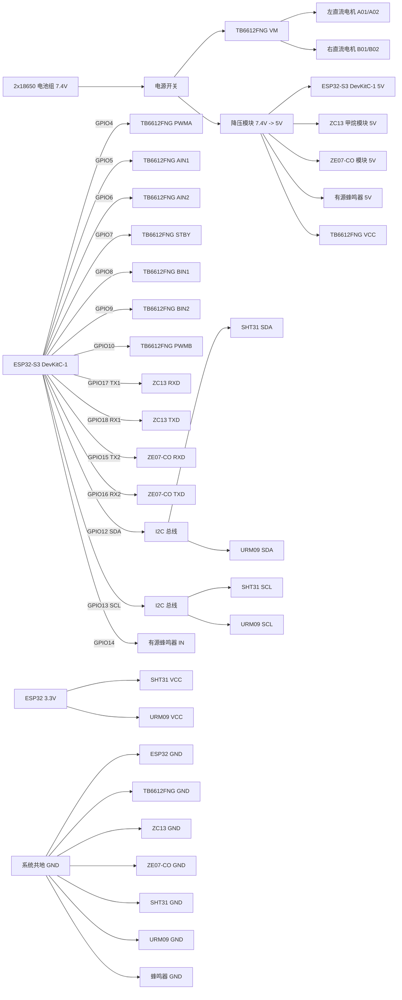

# ESP32 与各模块总接线示意图

这份图是基于当前原型方案整理的总接线图，适用于：

- 云端远程版
- 近程热点版

两个版本的车体硬件一致，只是通信方式不同，因此接线也一致。

## 1. 总体接线图



## 2. 按模块拆开的接线

### 2.1 ESP32 与电机驱动板 TB6612FNG

| ESP32-S3 | TB6612FNG | 说明 |
| --- | --- | --- |
| GPIO4 | PWMA | 左电机 PWM |
| GPIO5 | AIN1 | 左电机方向 |
| GPIO6 | AIN2 | 左电机方向 |
| GPIO7 | STBY | 驱动使能 |
| GPIO8 | BIN1 | 右电机方向 |
| GPIO9 | BIN2 | 右电机方向 |
| GPIO10 | PWMB | 右电机 PWM |
| 5V | VCC | 驱动逻辑供电 |
| GND | GND | 共地 |
| 7.4V 电池 | VM | 电机电源 |

电机输出：

- 左电机接 `A01/A02`
- 右电机接 `B01/B02`

### 2.2 ESP32 与甲烷模块 ZC13

| ESP32-S3 | ZC13 | 说明 |
| --- | --- | --- |
| 5V | Vin | 模块供电 |
| GND | GND | 共地 |
| GPIO17 TX1 | RXD | ESP32 发给 ZC13 |
| GPIO18 RX1 | TXD | ZC13 发给 ESP32 |

### 2.3 ESP32 与 CO 模块 ZE07-CO

| ESP32-S3 | ZE07-CO | 说明 |
| --- | --- | --- |
| 5V | Vin | 模块供电 |
| GND | GND | 共地 |
| GPIO15 TX2 | RXD | ESP32 发给 ZE07-CO |
| GPIO16 RX2 | TXD | ZE07-CO 发给 ESP32 |

### 2.4 ESP32 与 I2C 传感器

| ESP32-S3 | SHT31 | URM09 | 说明 |
| --- | --- | --- | --- |
| GPIO12 | SDA | SDA | I2C 数据线 |
| GPIO13 | SCL | SCL | I2C 时钟线 |
| 3.3V | VCC | VCC | 建议按 3.3V 供电 |
| GND | GND | GND | 共地 |

### 2.5 ESP32 与蜂鸣器

| ESP32-S3 | 蜂鸣器 | 说明 |
| --- | --- | --- |
| GPIO14 | IN | 报警控制 |
| 5V | VCC | 供电 |
| GND | GND | 共地 |

## 3. 电源分配图

```text
2x18650(7.4V)
   |
   +-- TB6612FNG VM ------------------> 左/右电机
   |
   +-- 降压模块 7.4V -> 5V
          |
          +-- ESP32 5V
          +-- ZC13 5V
          +-- ZE07-CO 5V
          +-- 蜂鸣器 5V
          +-- TB6612FNG VCC

ESP32 3.3V
   |
   +-- SHT31 3.3V
   +-- URM09 3.3V

所有 GND 必须共地
```

## 4. 线束颜色建议

为了后面调试不乱，建议一开始就统一线色：

- 红色：`5V`
- 橙色：`7.4V 电池正`
- 黑色：`GND`
- 蓝色：`I2C SDA`
- 绿色：`I2C SCL`
- 黄色：`UART TX`
- 白色：`UART RX`
- 紫色：`PWM/控制线`

## 5. 装车位置建议

为了答辩时更像完整产品，建议结构这样摆：

- 车头：`URM09 超声波`
- 车体中部上层：`ESP32 + TB6612FNG + 降压模块`
- 车体上层前部：`ZC13 + ZE07-CO`
- 车尾或上层边缘：`蜂鸣器`
- 底盘下层：`18650 电池盒`

## 6. 调试顺序

建议按下面顺序分步排错：

1. 先只接 `ESP32 + TB6612FNG + 电机`，验证前进后退。
2. 再接 `SHT31 + URM09`，验证 I2C 读数。
3. 再接 `ZC13`，验证甲烷串口数据。
4. 再接 `ZE07-CO`，验证 CO 串口数据。
5. 最后接蜂鸣器并联调整车。

## 7. 上板前检查清单

- 电机电源 `VM` 和逻辑电源 `VCC` 没有接反
- `RX/TX` 为交叉连接
- 所有模块 `GND` 已共地
- I2C 地址没有冲突
- 气体模块有足够预热时间
- 先空载测试，再上底盘联调
